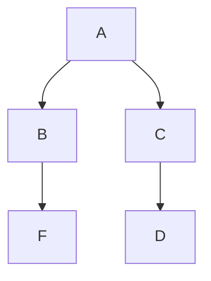
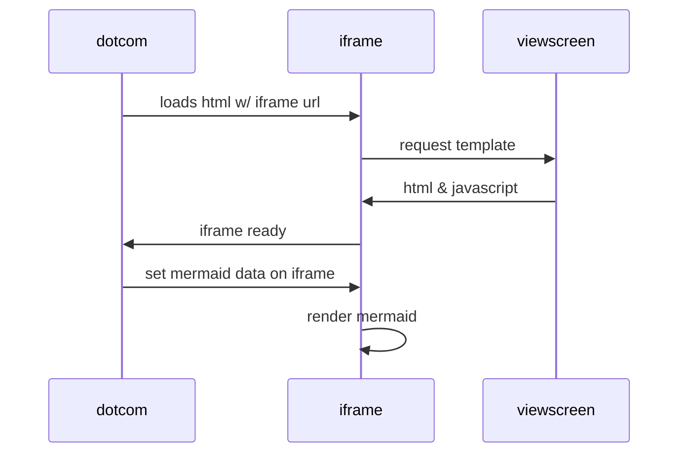
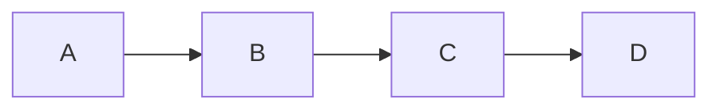
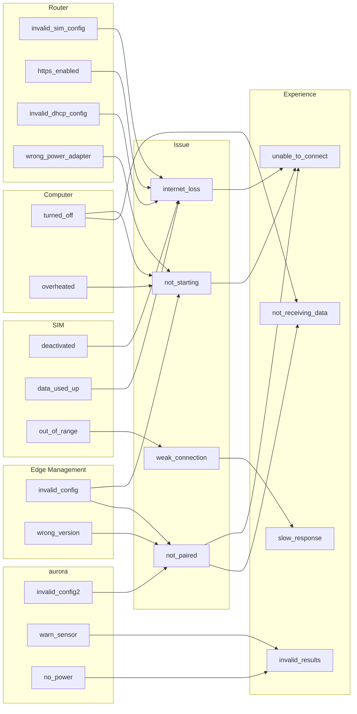
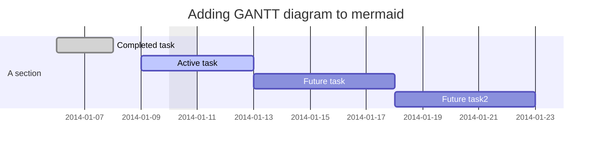
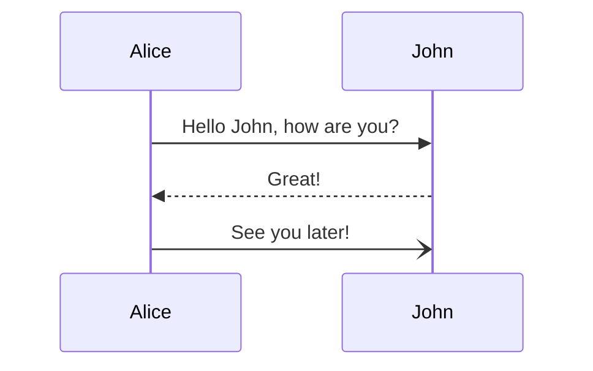

### Simple Example

### Sequence Diagram  

### Links in chart

### Pseudo-Fishbone

### Gantt

### Expanding entries

## References
- Mermaid Syntax - https://mermaid-js.github.io/mermaid/
- GitHub Blog - Mermaid Support  - https://github.blog/2022-02-14-include-diagrams-markdown-files-mermaid/